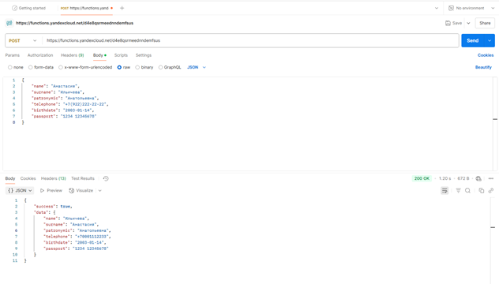
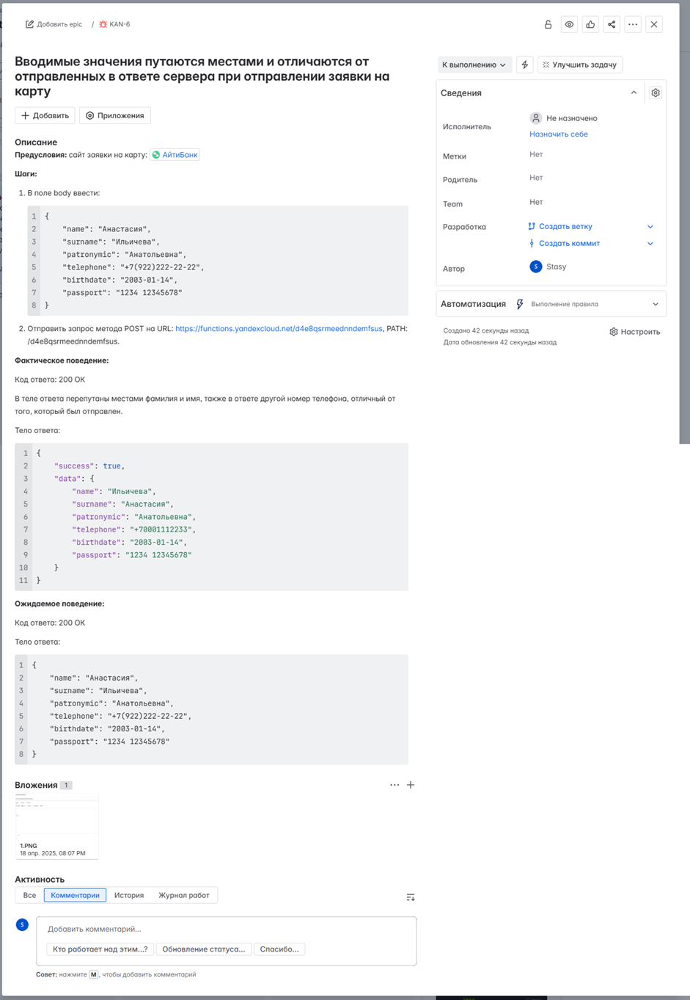

# API Testing (Postman)

Примеры тестирования API с использованием Postman.

---

## 🎯 О проекте

В рамках проекта выполнялось тестирование API сервиса с использованием Postman.

Проверялась корректность обработки запросов, структура ответов и соответствие данных.

---

## 📌 Что было сделано

- отправка HTTP-запросов (GET, POST)  
- проверка статус-кодов  
- проверка структуры JSON-ответа  
- тестирование позитивных и негативных сценариев  
- анализ корректности возвращаемых данных  

---

## 🛠 Инструменты

- Postman  

---

## 🧪 Область тестирования

- отправка данных в теле запроса (JSON)  
- проверка соответствия отправленных и полученных данных  
- проверка обработки пользовательских данных  
- тестирование API-эндпоинтов  

---

## 📸 Пример тестирования API

### 📥 Запрос-ответ

  

---

## 🐞 Пример найденного дефекта

Обнаружен дефект: значения полей `name` и `surname` меняются местами в ответе API,  
а номер телефона отличается от отправленного значения.

  

---

## 📌 Вывод

Проект демонстрирует базовые навыки тестирования API, включая работу с HTTP-запросами,
анализ ответов и выявление дефектов.
